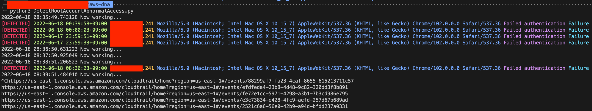

# Detect Root Account Abnormal Access For ConsoleLogin Event in AWS

## Before you use this...

1. Apply MFA for your ROOT ACCOUNT
2. Use complicated password
3. Refer to [this link](https://docs.aws.amazon.com/accounts/latest/reference/best-practices-root-user.html) for applying "The best practices root user"
4. Set your credential by referring to [this link](https://docs.aws.amazon.com/cli/latest/userguide/cli-configure-files.html)

## My Env

```bash
$ python3 --version
Python 3.9.12
```

## Usage

```bash
$ pip install -r requirements.txt
$ python3 DetectRootAccountAbnormalAccess.py.py
```



## Caution

### IF POSSIBLE, DO NOT TOUCH GLOBAL CONFIG

#### GLOBAL CONFIG LIST

- CLOUDTRAIL_URL : CloudTrail event url for accessing event directly. **DO NOT TOUCH NEVER.**
- SEARCH_HOURS : It's hours for searching events. You might change this value for your country time fitly
- SEARCH_CYCLE : It's a search time cycle. The default value is 60 seconds.
- MY_IP : Your PUBLIC IP address. If you wanna change this value? Do it.
- DETECTED_EVENT_IDS : This value stores detected events. **DO NOT TOUCH NEVER.**
